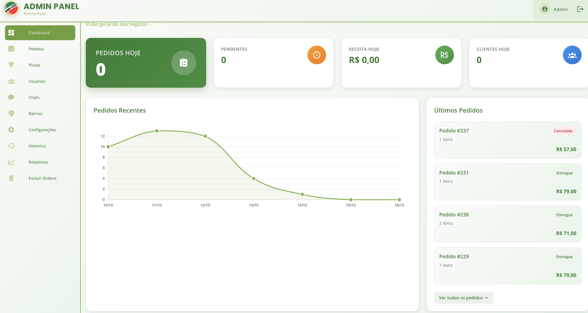
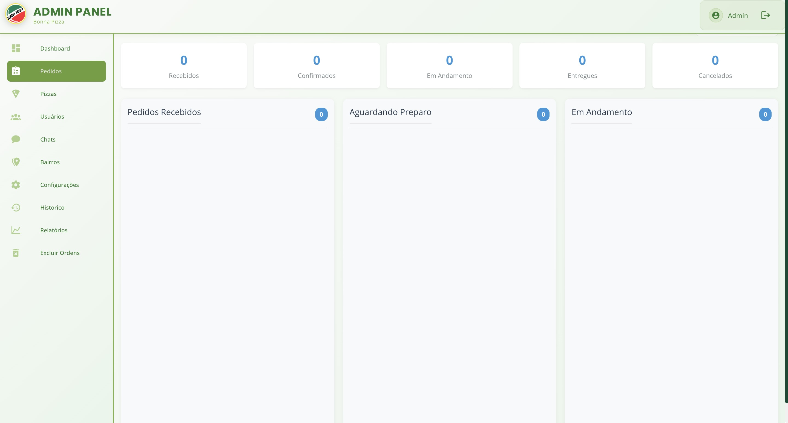
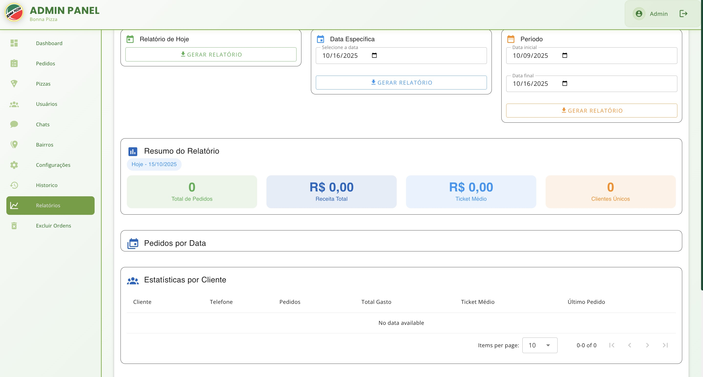
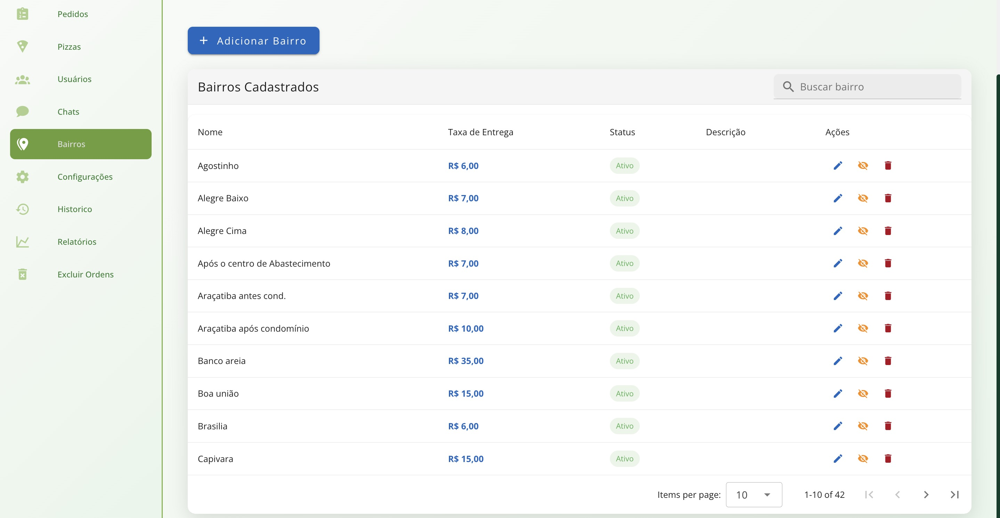

# 👨🏻‍💻 Mallone Matheus

**`Desenvolvedor FullStack`**

Olá! Sou **Mallone**, desenvolvedor **Full Stack** com foco em **PHP (Back-End)** e **Vue.js / React (Front-End)**.  
Trabalho na criação de sistemas web e mobile completos, com uma arquitetura sólida, código limpo e interfaces intuitivas.  
Tenho experiência no uso de **Laravel**, **MySQL** e **Docker**, além de outras ferramentas que fortalecem meu ecossistema de desenvolvimento.

---

### ⚙️ Linguagens e Tecnologias

 
 

---

## 🍕 Projetos

### Bonnapizza - Sistema de Gerenciamento de Pizzaria

Um sistema completo para pizzarias, com montagem de pizzas personalizadas, controle de pedidos, cadastro de clientes, gestão de produtos, taxa de entrega por bairro, chat em tempo real e painel administrativo responsivo.

🔒 _Código-fonte privado_  
🖥️ **Back-end:** Laravel + MySQL  
💻 **Front-end:** Vue.js

---

## 🍕 Screenshots do Bonnapizza

Aqui estão algumas imagens do sistema **Bonnapizza** em funcionamento!

  
  
  
  

---

## 🏢 Organizações

### 🏭 Ecossistema WMSGoSoft – Tecnologia e Inovação em Gestão de Armazéns

> 🗺️ A **WMSGoSoft Group**, sediada em **Glassboro, New Jersey (NJ)**, é uma empresa de tecnologia voltada ao **desenvolvimento de soluções avançadas para gestão de armazéns (WMS)**, com foco em **automação, rastreabilidade e eficiência operacional**.

- 🧠 **[@WMSGoSoftGroup](https://github.com/wmsgosoftware)** – Grupo responsável pela criação de **soluções integradas de Warehouse Management**, unindo **inovação, tecnologia e controle logístico inteligente**.

- 🚀 **[@GoColdStorage](https://github.com/gocoldstorage)** – Sistema voltado ao **controle inteligente de câmaras frias e armazenamento refrigerado**, com **monitoramento em tempo real**, **otimização de espaço** e **precisão operacional**.

- 📦 **[@GoProduce](https://github.com/goproduce)** – Plataforma de **gerenciamento e rastreamento de produtos agrícolas e perecíveis**, otimizando o **fluxo logístico**, a **qualidade dos produtos** e a **integração com centros de distribuição**.

### 📫 Contato

- 💼 **LinkedIn:** <a href="https://www.linkedin.com/in/mallonematheus" target="_blank">linkedin.com/in/mallonematheus</a>
- 📧 **E-mail:** <a href="mallonemateus.dev@gmail.com" target="_blank">mallonemateus.dev@gmail.com</a>

---
